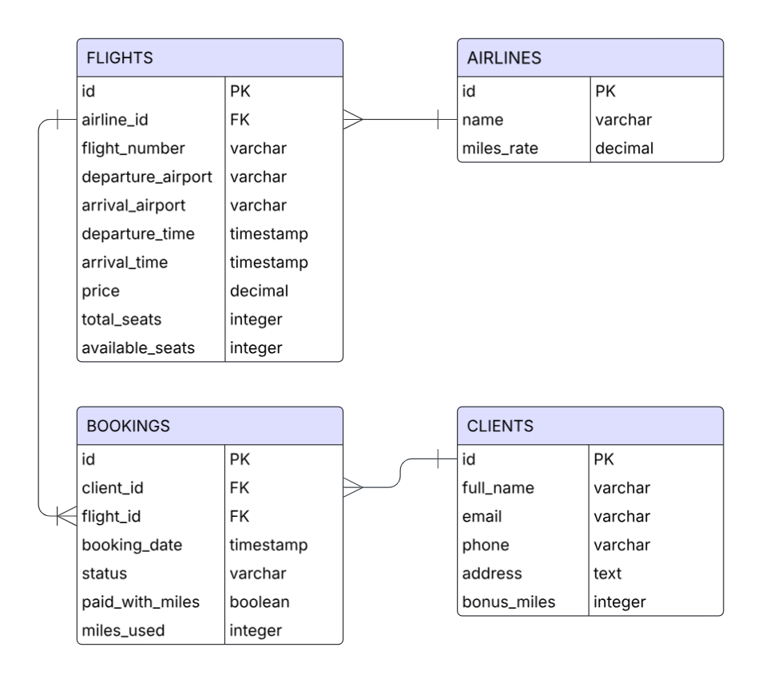

# Система информации об авиарейсах и билетах

## Схема базы данных

### Связи в базе данных:
- **AIRLINES (1) → FLIGHTS (N)** - одна авиакомпания может иметь много рейсов
- **CLIENTS (1) → BOOKINGS (N)** - один клиент может иметь много бронирований
- **FLIGHTS (1) → BOOKINGS (N)** - на один рейс может быть много бронирований

## Описание страниц веб-интерфейса

### 1. Главная страница
- Форма поиска рейсов по направлению и дате (аэропорт вылета, аэропорт прилета, дата)
- Ссылка на список всех рейсов
- Ссылка на список всех клиентов

### 2. Страница со списком рейсов
- Таблица всех рейсов с информацией: номер рейса, авиакомпания, маршрут, время вылета/прилета, цена, свободные места
- Кнопка "Забронировать" для каждого рейса с доступными местами
- Ссылка "Добавить новый рейс"
- Сортировка по дате, цене, направлению

### 3. Страница со списком клиентов
- Список всех клиентов с основной информацией: ФИО, email, бонусные мили
- Кликабельные ссылки на персональные страницы клиентов
- Поиск клиента по имени или email
- Ссылка "Добавить нового клиента"

### 4. Персональная страница клиента
- Полная информация о клиенте: ФИО, контактные данные, адрес
- Количество накопленных бонусных миль
- История бронирований клиента с указанием статуса (забронирован/оплачен/отменен)
- Возможность редактирования данных клиента
- Функционал использования миль для оплаты будущих билетов

### 5. Страница бронирования билета
- Информация о выбранном рейсе
- Выпадающий список для выбора клиента
- Кнопка подтверждения бронирования

### 6. Страница добавления рейса
- Форма для ввода данных рейса: номер, авиакомпания, аэропорт вылета/прилета, дата и время вылета/прилета, цена билета, общее количество мест
- Валидация введенных данных
- Кнопка сохранения рейса

### 7. Страница добавления клиента
- Форма для ввода персональных данных: ФИО, email, телефон, адрес
- Поле для начального количества бонусных миль
- Кнопка сохранения клиента

## Сценарии использования

### 1. Бронирование билета на рейс
1. Перейти на главную страницу
2. Использовать поиск рейсов или перейти в список всех рейсов
3. Выбрать подходящий рейс, нажать "Забронировать"
4. На странице бронирования выбрать клиента из списка
5. Подтвердить бронирование

### 2. Добавление нового рейса
1. Перейти на главную страницу
2. Перейти на страницу списка рейсов
3. Нажать "Добавить новый рейс"
4. Заполнить все необходимые поля формы (номер, авиакомпания, маршрут, время, цена, места)
5. Подтвердить добавление рейса

### 3. Просмотр истории клиента и его бонусов
1. Перейти на главную страницу
2. Перейти на страницу списка клиентов
3. Найти нужного клиента (поиском или прокруткой)
4. Перейти на персональную страницу клиента
5. Просмотреть историю бронирований и количество бонусных миль

### 4. Добавление нового клиента
1. Перейти на главную страницу
2. Перейти на страницу списка клиентов
3. Нажать "Добавить нового клиента"
4. Заполнить персональные данные и контактную информацию
5. Указать начальное количество бонусных миль (если есть)
6. Подтвердить добавление клиента

### 5. Поиск рейсов по направлению и дате
1. Перейти на главную страницу
2. Заполнить форму поиска: указать аэропорты вылета/прилета и дату
3. Система покажет подходящие рейсы
4. Выбрать нужный рейс для дальнейшего бронирования

### 6. Управление данными клиента
1. Найти клиента через список клиентов
2. Перейти на его персональную страницу
3. Отредактировать контактную информацию
4. Сохранить изменения

## Поддерживаемые данные

### Авиарейсы
- Компания, номер рейса
- Аэропорты вылета и прилета
- Время и даты вылета и прилета
- Стоимость билетов
- Количество мест и наличие свободных мест

### Клиенты
- ФИО
- Контактная информация: адрес, телефон, e-mail
- Заказанные билеты, оплаченные билеты
- Накопленные бонусные мили
- Использование миль для оплаты билетов

### Авиакомпании
- Название компании
- Коэффициент начисления бонусных миль

### Бронирования
- Связь клиента с рейсом
- Статус бронирования (забронирован/оплачен/отменен)
- Информация об оплате милями
- Дата бронирования

## Поддерживаемые операции

- Получение списка авиарейсов по датам и направлениям
- Информация о ценах билетов и наличии свободных мест
- Получение списка клиентов, в т.ч. летавших определенным рейсом
- Получение истории заказов клиента, информации о его бонусах
- Заказ и оплата билетов на выбранный рейс
- Добавление и удаление рейса, чтение и редактирование данных о нем
- Добавление и удаление клиента, чтение и редактирование данных о нем
